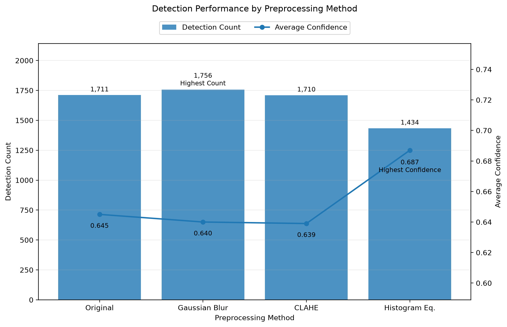
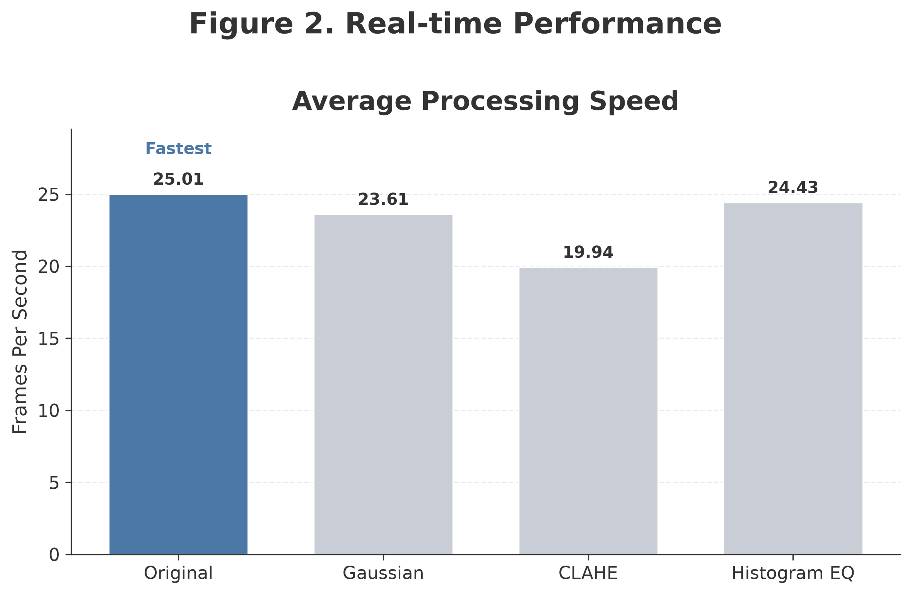
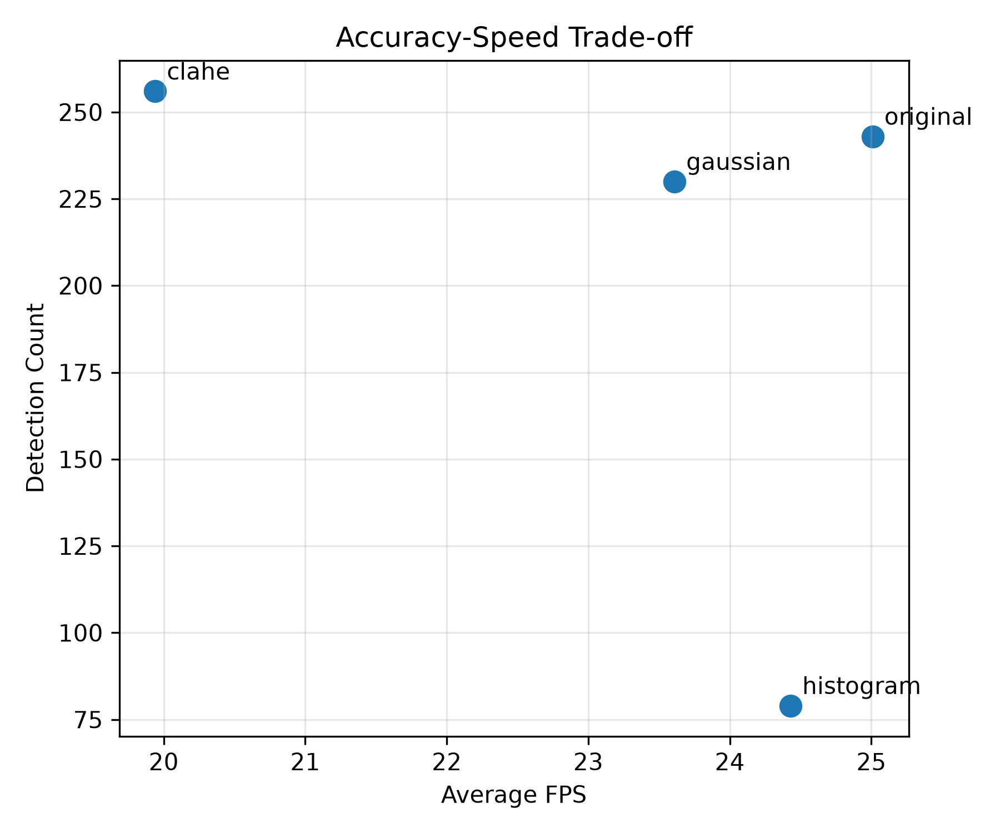

# Industrial Vision Inspection System

A real-time industrial vision inspection system using **YOLO11n**, **OpenCV**, and multiple image preprocessing techniques.

This project compares preprocessing methods by evaluating both detection performance and real-time processing speed.

---

## Project Overview

The objective of this project is to investigate how different preprocessing techniques influence YOLO11n object detection performance in an industrial video environment.

The system supports camera and video input, performs object detection, records frame-level results, measures performance, and generates visualizations using Matplotlib.

---

## Key Features

* Real-time object detection using YOLO11n
* Camera and video input support
* Four preprocessing modes

  * Original
  * Gaussian Blur
  * CLAHE
  * Histogram Equalization
* Detection count and average confidence measurement
* Real-time FPS measurement
* Frame-level CSV logging
* Automatic performance graph generation

---

## Workflow

```text
Input (Camera / Video)
        │
        ▼
Image Preprocessing
        │
        ▼
YOLO11n Object Detection
        │
        ▼
Bounding Box Visualization
        │
        ▼
Performance Measurement
        │
        ▼
CSV Logging
        │
        ▼
Graph Generation
```

---

## Project Structure

```text
IndustrialVision/
│
├── assets/
│   ├── figure1_detection_performance.png
│   ├── figure2_fps.png
│   └── figure3_tradeoff.png
│
├── core/
│   ├── camera.py
│   ├── detector.py
│   └── preprocessor.py
│
├── inputs/
│   └── videos/
│
├── outputs/
│   ├── detection_results.csv
│   └── metrics/
│       └── performance.csv
│
├── scripts/
│   └── graphs.py
│
├── utils/
│   ├── csv_writer.py
│   ├── fps.py
│   └── metrics.py
│
├── config.py
├── main.py
└── README.md
```

---

## Preprocessing Methods

| Method                 | Description                                    |
| ---------------------- | ---------------------------------------------- |
| Original               | Uses the original input frame                  |
| Gaussian Blur          | Reduces image noise through Gaussian filtering |
| CLAHE                  | Enhances local contrast in the image           |
| Histogram Equalization | Enhances global image contrast                 |

---

## Experimental Results

The four preprocessing methods were evaluated using the same input video and YOLO11n model.

| Preprocessing Method   | Detection Count | Average Confidence | Average FPS | Result                 |
| ---------------------- | --------------: | -----------------: | ----------: | ---------------------- |
| Original               |             243 |              0.635 |   **25.01** | Fastest                |
| Gaussian Blur          |             230 |              0.634 |       23.61 | Slight smoothing       |
| **CLAHE**              |         **256** |          **0.679** |       19.94 | **Best detection**     |
| Histogram Equalization |              79 |              0.640 |       24.43 | Lowest detection count |

---

## Detection Performance



CLAHE achieved the highest detection count and average confidence. This indicates that local contrast enhancement improved object visibility for the YOLO11n detector.

---

## Real-time Performance



The original input achieved the highest average FPS. CLAHE produced better detection results but required additional preprocessing time.

---

## Accuracy–Speed Trade-off



The results demonstrate a trade-off between detection performance and processing speed:

* **CLAHE** is suitable when detection performance is the priority.
* **Original** is suitable when real-time processing speed is the priority.
* Histogram Equalization maintained relatively high FPS but significantly reduced the detection count.

---

## Running the Project

Run the object detection experiment:

```bash
python main.py
```

Select a preprocessing method:

```text
[1] Original
[2] Gaussian Blur
[3] CLAHE
[4] Histogram Equalization
```

Press `q` to stop processing before the video ends.

---

## Generating the Graphs

Run the graph-generation script:

```bash
python scripts/graphs.py
```

The script reads:

```text
outputs/metrics/performance.csv
```

It generates:

```text
assets/
├── figure1_detection_performance.png
├── figure2_fps.png
└── figure3_tradeoff.png
```

The generated PNG files are displayed in this README using Markdown image syntax.

---

## Technologies

* Python
* OpenCV
* Ultralytics YOLO11n
* Matplotlib
* CSV
* Git and GitHub

---

## Future Work

* Evaluate additional industrial videos
* Compare different YOLO model sizes
* Train a custom model for industrial components and defects
* Add Precision, Recall, and mAP evaluation
* Optimize inference for edge devices
* Add ROI-based inspection and defect classification
