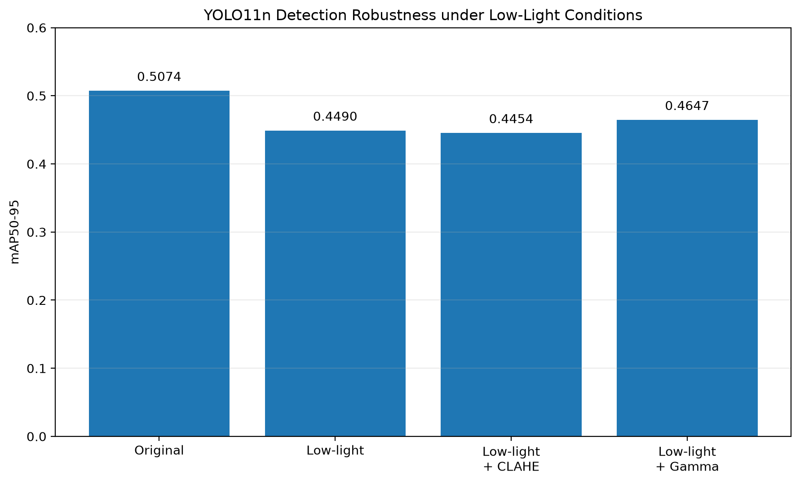
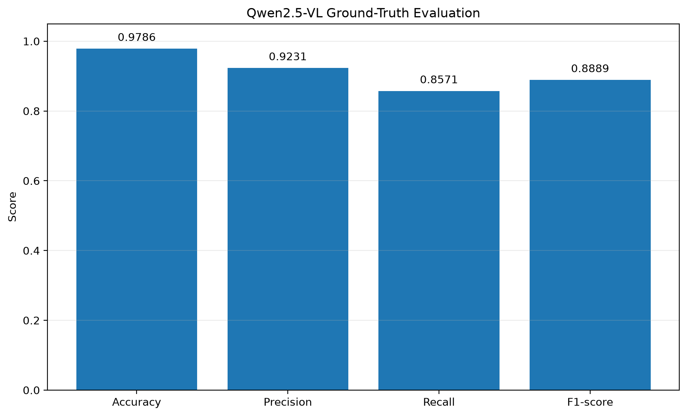

# Industrial Vision Inspection System

A computer vision evaluation pipeline using **YOLO11n**, **OpenCV**, and **Qwen2.5-VL** for real-time object detection, preprocessing analysis, robustness evaluation, and multimodal visual understanding.

The project began as a real-time YOLO-based vision pipeline for comparing image preprocessing techniques and was progressively extended to include **ground-truth-based evaluation**, **low-light robustness analysis**, and **Vision-Language Model (VLM) evaluation**.

The main objective is not only to run pretrained AI models, but also to quantitatively investigate how model behavior changes under different preprocessing and environmental conditions.

---

# Project Overview

The project consists of three experimental phases.

## Phase 1 — Real-Time Vision Pipeline

A modular YOLO11n + OpenCV pipeline was implemented to evaluate preprocessing methods on the same urban video.

Four preprocessing modes were compared:

- Original
- Gaussian Blur
- CLAHE
- Histogram Equalization

Performance was measured using:

- Detection Count
- Average Confidence
- Average FPS

The experiment revealed that the preprocessing method with the highest Detection Count was different from the method with the highest Average Confidence, while the unprocessed input achieved the highest FPS.

This motivated a more rigorous ground-truth-based evaluation.

---

## Phase 2 — Ground-Truth-Based Robustness Evaluation

Detection Count and Average Confidence alone cannot determine whether preprocessing actually improves object detection accuracy.

The pipeline was therefore extended using **COCO128 ground-truth annotations** and standard object detection metrics:

- Precision
- Recall
- mAP50
- mAP50-95

A synthetic low-light condition was generated to evaluate YOLO11n robustness.

CLAHE and Gamma Correction were subsequently evaluated to determine whether preprocessing could recover degraded detection performance.

---

## Phase 3 — Vision-Language Model Evaluation

The project was further extended using **Qwen2.5-VL-3B-Instruct**.

The VLM was used for structured image understanding and evaluated through:

- Structured JSON prediction
- YOLO-VLM comparison
- COCO ground-truth evaluation
- Precision / Recall / F1 analysis
- Error analysis

---

# System Architecture

## Phase 1 — Real-Time Detection

```text
Video Input
    ↓
Frame Acquisition
    ↓
Preprocessing
    ↓
YOLO11n Detection
    ↓
Performance Measurement
    ↓
CSV Logging
    ↓
Performance Visualization
```

The pipeline separates input handling, preprocessing, detection, performance measurement, and result analysis into independent modules.

This modular structure allows individual components to be modified and evaluated independently.

---

## Phase 2 — Robustness Evaluation

```text
COCO128
    ↓
Synthetic Low-Light Transformation
    ↓
Preprocessing
    ↓
YOLO11n Evaluation
    ↓
Precision / Recall / mAP
    ↓
Robustness Analysis
```

---

## Phase 3 — VLM Evaluation

```text
COCO Image
    ↓
Qwen2.5-VL
    ↓
Structured JSON Prediction
    ↓
COCO Ground Truth
    ↓
Binary Class Comparison
    ↓
Precision / Recall / F1
```

---

# Project Structure

```text
IndustrialVision/
│
├── assets/
│   ├── figure1_detection_performance.png
│   ├── figure2_fps.png
│   ├── figure3_tradeoff.png
│   ├── figure4_lowlight_robustness.png
│   └── figure5_vlm_evaluation.png
│
├── core/
│   ├── camera.py
│   ├── detector.py
│   └── preprocessor.py
│
├── evaluation/
│   ├── __init__.py
│   ├── evaluate.py
│   ├── create_clahe.py
│   ├── create_gamma.py
│   ├── extract_frame.py
│   ├── vlm_inference.py
│   ├── vlm_compare.py
│   └── vlm_ground_truth_eval.py
│
├── inputs/
│   ├── images/
│   └── videos/
│
├── models/
│   └── yolo11n.pt
│
├── outputs/
│   ├── images/
│   ├── metrics/
│   │   └── performance.csv
│   ├── evaluation/
│   └── vlm/
│
├── scripts/
│   ├── graphs.py
│   └── extended_graphs.py
│
├── utils/
│   ├── csv_writer.py
│   ├── fps.py
│   └── metrics.py
│
├── config.py
├── main.py
├── requirements.txt
├── README.md
└── .gitignore
```

Large datasets, model weights, and input videos may be excluded from the repository because of their file size.

---

# Phase 1 — Real-Time Detection & Preprocessing

## YOLO11n Inference

YOLO11n is integrated into the video processing pipeline for frame-level object detection.

The system extracts:

- Bounding boxes
- Class labels
- Confidence scores

---

## Video Processing

OpenCV is used for:

- Video frame acquisition
- Image preprocessing
- Detection visualization
- Result image handling

---

## Image Preprocessing

Four preprocessing modes are supported.

### Original

Uses the input frame without additional preprocessing.

### Gaussian Blur

Applies Gaussian smoothing to reduce image noise.

### CLAHE

Applies Contrast Limited Adaptive Histogram Equalization to locally enhance image contrast.

### Histogram Equalization

Applies global histogram equalization to modify image contrast.

---

# Phase 1 Experiment Design

All preprocessing methods were evaluated under identical video conditions.

## Test Conditions

- Same urban input video (`city.mp4`)
- 573 frames
- Same YOLO11n model
- Same detection configuration
- Same processing pipeline
- Only the preprocessing method was changed

## Test Video

The Phase 1 experiment was conducted using the same urban street video across all preprocessing configurations.

- **Source:** Pexels
- **Creator:** Sururi Ballıdağ
- **Video:** Busy City Street with Cars and Pedestrians
- **Local filename:** `city.mp4`
- **Frames used:** 573

[View the original video on Pexels](https://www.pexels.com/video/busy-city-street-with-cars-and-pedestrians-37301739/)

The video file itself is excluded from this repository through `.gitignore`.

## Evaluation Metrics

| Metric | Purpose |
|---|---|
| Detection Count | Number of detections produced during the video |
| Average Confidence | Average confidence of detected objects |
| Average FPS | Real-time processing performance |

## Experiment Flow

```text
city.mp4
    ↓
Same 573 Frames
    ↓
Original / Gaussian / CLAHE / Histogram
    ↓
YOLO11n
    ↓
Detection Count / Confidence / FPS
    ↓
Comparative Analysis
```

---

# Phase 1 Experimental Results

## Quantitative Comparison

| Preprocessing Method | Detection Count | Average Confidence | Average FPS | Observation |
|---|---:|---:|---:|---|
| Original | 1,711 | 0.645 | **16.63** | Highest FPS |
| **Gaussian Blur** | **1,756** | 0.640 | 11.91 | Highest Detection Count |
| CLAHE | 1,710 | 0.639 | 10.68 | Similar Detection Count to Original |
| Histogram Equalization | 1,434 | **0.687** | 8.31 | Highest Confidence |

The results show that no preprocessing method simultaneously achieved the highest Detection Count, Average Confidence, and FPS.

---

## Detection Performance


Gaussian Blur produced the highest Detection Count at **1,756**, compared with **1,711** for the Original mode.

However, its Average Confidence slightly decreased from **0.645 to 0.640**.

Histogram Equalization showed a different behavior. It achieved the highest Average Confidence at **0.687**, while producing the lowest Detection Count at **1,434**.

CLAHE produced almost the same Detection Count as the Original mode:

```text
Original : 1,711
CLAHE    : 1,710
```

but required additional computation.

These results demonstrate that Detection Count and Average Confidence can respond differently to preprocessing.

---

## Real-Time Performance


The Original mode achieved the highest processing speed:

```text
Original               : 16.63 FPS
Gaussian Blur          : 11.91 FPS
CLAHE                   : 10.68 FPS
Histogram Equalization :  8.31 FPS
```

All three preprocessing methods reduced processing throughput compared with the Original input.

Histogram Equalization introduced the largest processing overhead in the tested pipeline.

This demonstrates that preprocessing must be evaluated not only in terms of changes in detector output, but also in terms of computational cost.

---

## Detection Performance-Speed Trade-off


The experiment revealed different advantages for each configuration:

- **Gaussian Blur** produced the highest Detection Count.
- **Histogram Equalization** produced the highest Average Confidence.
- **Original** achieved the highest FPS.
- **CLAHE** produced a Detection Count similar to Original while reducing processing speed.

No configuration dominated all evaluation metrics.

More importantly, Detection Count and Average Confidence do not directly measure whether detections correspond correctly to ground-truth objects.

A larger number of detections may include additional false positives, while higher confidence does not necessarily imply better localization accuracy.

This limitation motivated the ground-truth-based evaluation performed in Phase 2.

---

# Phase 2 — Ground-Truth-Based Evaluation

The Phase 1 experiment evaluated model behavior using Detection Count, Average Confidence, and FPS.

However, these metrics alone cannot determine whether preprocessing actually improves detection accuracy.

The evaluation pipeline was therefore extended using **COCO128 ground-truth annotations**.

Standard object detection metrics were introduced:

- Precision
- Recall
- mAP50
- mAP50-95

This enabled preprocessing methods to be evaluated against actual annotations rather than detector output alone.

---

# Low-Light Robustness Experiment

A synthetic low-light dataset was generated from COCO128 to investigate YOLO11n robustness under illumination degradation.

The brightness transformation used:

```text
Brightness Factor = 0.2
```

The same pretrained YOLO11n model was evaluated before and after the transformation.

## Baseline vs Low-Light

| Condition | Precision | Recall | mAP50 | mAP50-95 |
|---|---:|---:|---:|---:|
| Original | 0.6677 | 0.5982 | 0.6738 | 0.5074 |
| Low-light ×0.2 | 0.6838 | 0.5140 | 0.5945 | 0.4490 |

The synthetic low-light condition reduced mAP50-95 from:

```text
0.5074 → 0.4490
```

This corresponds to approximately an **11.5% relative decrease**.

Recall also decreased:

```text
0.5982 → 0.5140
```

The experiment demonstrates that substantial illumination degradation can reduce the detection capability of a pretrained object detector even when the model and evaluation pipeline remain unchanged.

---

# Low-Light Preprocessing Evaluation

Two preprocessing approaches were subsequently evaluated to determine whether degraded detection performance could be recovered.

## CLAHE

CLAHE was applied to enhance local contrast in the low-light images.

## Gamma Correction

Gamma Correction was applied using:

```text
Gamma = 0.5
```

## Quantitative Comparison

| Condition | Precision | Recall | mAP50 | mAP50-95 |
|---|---:|---:|---:|---:|
| Original | 0.6677 | 0.5982 | 0.6738 | 0.5074 |
| Low-light ×0.2 | 0.6838 | 0.5140 | 0.5945 | 0.4490 |
| Low-light + CLAHE | 0.7091 | 0.5230 | 0.6015 | 0.4454 |
| **Low-light + Gamma** | **0.7336** | **0.5249** | **0.6157** | **0.4647** |

Gamma Correction produced the strongest overall recovery among the tested low-light preprocessing methods.

mAP50-95 improved from:

```text
Low-light : 0.4490
Gamma     : 0.4647
```

However, it did not fully recover the original performance of:

```text
Original : 0.5074
```

CLAHE increased Precision, Recall, and mAP50 compared with the low-light condition, but its mAP50-95 decreased slightly:

```text
Low-light         : 0.4490
Low-light + CLAHE : 0.4454
```

This demonstrates that improvements in one evaluation metric do not necessarily translate into improvements across all metrics.

---

## Low-Light Robustness Visualization



The visualization summarizes the degradation caused by the synthetic low-light condition and the different effects of CLAHE and Gamma Correction.

Gamma Correction partially recovered detection performance, while CLAHE showed mixed results depending on the evaluation metric.

---

# Phase 1 vs Phase 2

An important finding of the project emerged when the two experiments were considered together.

In Phase 1, preprocessing changed Detection Count and Average Confidence substantially.

For example:

```text
Gaussian Blur
Detection Count = 1,756
Highest among Phase 1 configurations
```

while:

```text
Histogram Equalization
Average Confidence = 0.687
Highest among Phase 1 configurations
```

However, neither metric directly establishes detection accuracy.

Phase 2 therefore introduced ground-truth-based metrics and demonstrated that preprocessing effects must be evaluated using metrics appropriate to the actual task.

This changed the evaluation approach from:

```text
"How many detections did the model produce?"
```

to:

```text
"How accurately did the model detect annotated objects?"
```

---

# Phase 3 — Vision-Language Model Extension

The project was further extended from conventional object detection to multimodal visual understanding using:

**Qwen2.5-VL-3B-Instruct**

Instead of relying only on free-form image descriptions, the VLM was prompted to determine whether predefined object categories were present in an image.

The model output was constrained to structured JSON.

Example:

```json
{
    "person": false,
    "car": true,
    "bus": false,
    "bicycle": false,
    "motorcycle": false,
    "traffic light": false,
    "umbrella": true
}
```

Structured output allows VLM predictions to be automatically parsed and compared with other models or ground-truth annotations.

---

# YOLO vs VLM Comparison

YOLO11n and Qwen2.5-VL were first applied to the same frame extracted from the urban test video.

YOLO detected:

```text
car
car
```

The VLM produced:

```json
{
    "person": false,
    "car": true,
    "bus": false,
    "bicycle": false,
    "motorcycle": false,
    "traffic light": false,
    "umbrella": true
}
```

## Model Comparison

| Class | YOLO | VLM | Agreement |
|---|---|---|---|
| person | False | False | True |
| car | True | True | True |
| bus | False | False | True |
| bicycle | False | False | True |
| motorcycle | False | False | True |
| traffic light | False | False | True |
| umbrella | False | True | False |

The two models agreed on 6 of the 7 selected categories.

```text
Agreement Rate = 85.71%
```

The disagreement occurred for the `umbrella` category.

This comparison was used to investigate differences between a conventional object detector and a multimodal VLM.

The Agreement Rate represents **model-to-model agreement and is not interpreted as ground-truth accuracy**.

---

# VLM Ground-Truth Evaluation

The next experiment evaluated Qwen2.5-VL predictions against COCO128 annotations.

Seven object categories were evaluated:

- person
- bicycle
- car
- motorcycle
- bus
- traffic light
- umbrella

Twenty images were sampled for the preliminary experiment.

Each image generated seven binary object-presence predictions:

```text
20 images × 7 classes
= 140 binary predictions
```

## Evaluation Results

| Metric | Result |
|---|---:|
| True Positive | 12 |
| True Negative | 125 |
| False Positive | 1 |
| False Negative | 2 |
| Accuracy | 97.86% |
| Precision | **92.31%** |
| Recall | **85.71%** |
| F1-score | **88.89%** |

The VLM correctly predicted most of the evaluated object-presence labels in the sampled dataset.

However, the dataset contains substantially more negative labels than positive labels:

```text
TP + FN = 14 positive labels
TN + FP = 126 negative labels
```

Therefore, Accuracy alone would overstate model performance.

Precision, Recall, and F1-score are considered together when interpreting the result.

This experiment is a **preliminary sampled evaluation** and should not be interpreted as full COCO benchmark performance.

---

## VLM Evaluation Visualization



The sampled evaluation produced:

```text
Precision : 0.9231
Recall    : 0.8571
F1-score  : 0.8889
```

The results demonstrate that structured VLM outputs can be incorporated into a conventional quantitative evaluation pipeline.

---

# VLM Error Analysis

Three prediction errors occurred across the 140 evaluated binary labels.

## False Positive

One image was predicted to contain a:

```text
traffic light
```

when the selected target class was absent from the corresponding ground-truth annotation.

## False Negatives

The VLM failed to identify:

```text
1 person
1 car
```

that were present in the corresponding ground-truth annotations.

These errors demonstrate that even when a VLM performs well at high-level scene understanding, structured object-presence predictions can still produce false positives and false negatives.

A larger and more class-balanced evaluation would be required for stronger conclusions.

---

# Project Evolution

The project evolved incrementally from implementation toward quantitative AI model evaluation.

```text
Real-Time YOLO Detection
          ↓
OpenCV Preprocessing
          ↓
Detection / Confidence / FPS Logging
          ↓
Real-World Video Comparison
          ↓
Evaluation Limitation Identified
          ↓
COCO Ground-Truth Evaluation
          ↓
Low-Light Robustness Analysis
          ↓
Preprocessing Recovery Experiment
          ↓
Qwen2.5-VL Integration
          ↓
Structured Multimodal Output
          ↓
YOLO-VLM Comparison
          ↓
Ground-Truth VLM Evaluation
          ↓
Error Analysis
```

The evaluation perspective progressively changed from:

```text
"How many objects were detected?"
```

to:

```text
"Are those detections actually correct?"
```

and finally:

```text
"How does a multimodal model interpret the same type of visual information?"
```

---

# Key Findings

### 1. Preprocessing Introduces Multiple Trade-offs

No preprocessing configuration achieved the best result across Detection Count, Average Confidence, and FPS simultaneously.

In the urban video experiment:

```text
Highest Detection Count → Gaussian Blur
Highest Confidence      → Histogram Equalization
Highest FPS             → Original
```

### 2. Detection Count Is Not Detection Accuracy

A higher number of detections does not necessarily mean that more objects were detected correctly.

Ground-truth annotations are required to distinguish correct detections from false positives and localization errors.

### 3. Illumination Degradation Affects Detection Robustness

Synthetic low-light degradation reduced YOLO11n mAP50-95:

```text
0.5074 → 0.4490
```

### 4. Preprocessing Requires Quantitative Validation

Gamma Correction partially recovered mAP50-95:

```text
0.4490 → 0.4647
```

while CLAHE showed different effects depending on the metric.

### 5. VLM Output Can Be Structured and Evaluated

Qwen2.5-VL was integrated using structured JSON output and evaluated against COCO annotations.

The sampled evaluation achieved:

```text
Precision : 92.31%
Recall    : 85.71%
F1-score  : 88.89%
```

---

# What I Learned

Through this project, I gained practical experience in:

- Building a modular real-time Computer Vision pipeline
- YOLO11n object detection
- OpenCV video processing
- Image preprocessing
- Real-time inference measurement
- CSV-based experiment logging
- Matplotlib visualization
- Ground-truth-based object detection evaluation
- Precision / Recall / mAP interpretation
- Environmental robustness testing
- Vision-Language Model inference
- Structured VLM prompting
- YOLO-VLM comparative analysis
- Ground-truth-based VLM evaluation
- False Positive / False Negative analysis

More importantly, the project demonstrated the difference between **observing model output** and **quantitatively validating model behavior**.

The initial pipeline focused on real-time detection behavior. The evaluation was subsequently extended after identifying the limitations of Detection Count and Average Confidence, and finally expanded toward multimodal visual understanding using a VLM.

---

# Tech Stack

## Language

- Python

## Computer Vision / AI

- YOLO11n
- Ultralytics
- OpenCV
- PyTorch
- Qwen2.5-VL-3B-Instruct
- Hugging Face Transformers

## Data Analysis & Visualization

- NumPy
- Pandas
- Matplotlib

## Development

- Git
- GitHub
- VS Code

---

# How to Run

## 1. Create a Virtual Environment

```bash
python -m venv cv_env
```

## 2. Activate the Environment

Windows:

```bash
cv_env\Scripts\activate
```

## 3. Install Dependencies

```bash
pip install -r requirements.txt
```

## 4. Run the Real-Time Vision Pipeline

```bash
python main.py
```

Select one preprocessing mode:

```text
[1] Original
[2] Gaussian Blur
[3] CLAHE
[4] Histogram Equalization
```

## 5. Generate Phase 1 Graphs

```bash
python scripts/graphs.py
```

The following figures are generated:

```text
assets/
├── figure1_detection_performance.png
├── figure2_fps.png
└── figure3_tradeoff.png
```

## 6. Generate Extended Evaluation Graphs

```bash
python scripts/extended_graphs.py
```

## 7. Run VLM Inference

```bash
python -m evaluation.vlm_inference
```

## 8. Compare YOLO and VLM

```bash
python -m evaluation.vlm_compare
```

## 9. Run VLM Ground-Truth Evaluation

```bash
python -m evaluation.vlm_ground_truth_eval
```

---

# Limitations & Future Work

Current limitations include:

- Synthetic low-light transformation rather than a dedicated real-world low-light dataset
- Small and class-imbalanced VLM evaluation sample
- CPU-based VLM inference
- Pretrained models without domain-specific fine-tuning
- Binary object-presence evaluation for the VLM rather than localization evaluation

Future work includes:

- Larger and class-balanced VLM evaluation
- Real-world low-light datasets
- Domain-specific model fine-tuning
- Segmentation and anomaly detection
- Edge-device inference optimization
- VLM-based scene reasoning beyond object-presence classification
- Custom industrial inspection datasets

---

# Notes

YOLO model weights, VLM weights, datasets, and input video files may be excluded from the repository through `.gitignore` because of their file size.

The experimental results presented in this repository should be interpreted within the datasets, preprocessing conditions, model configurations, and sample sizes described above.